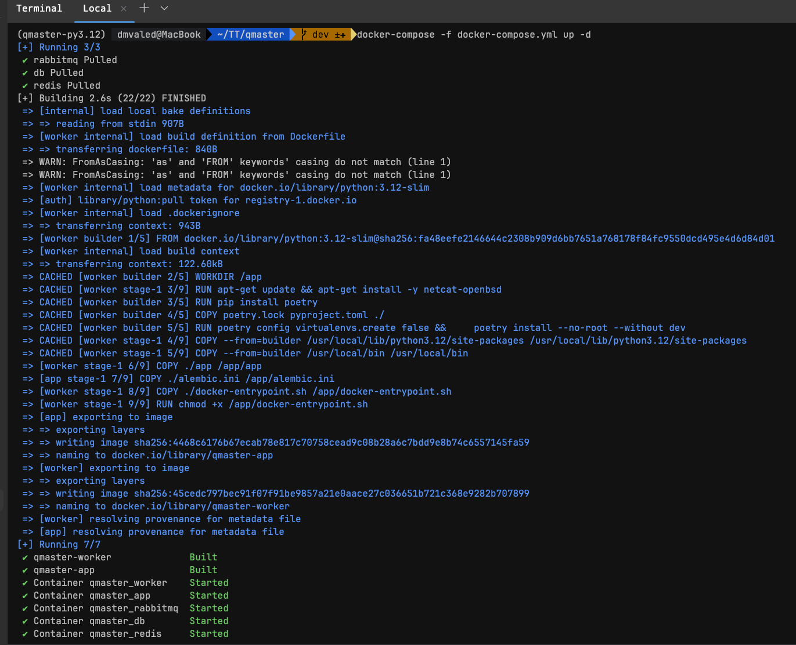
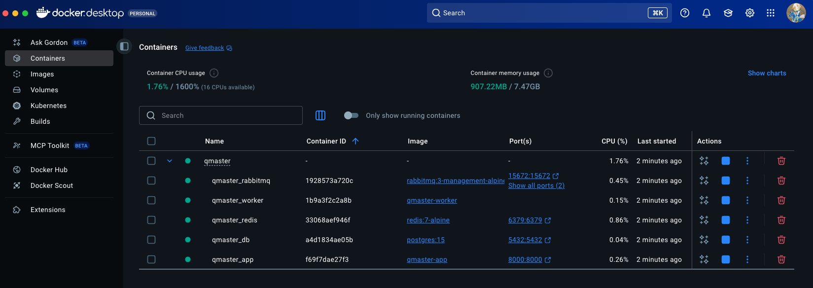
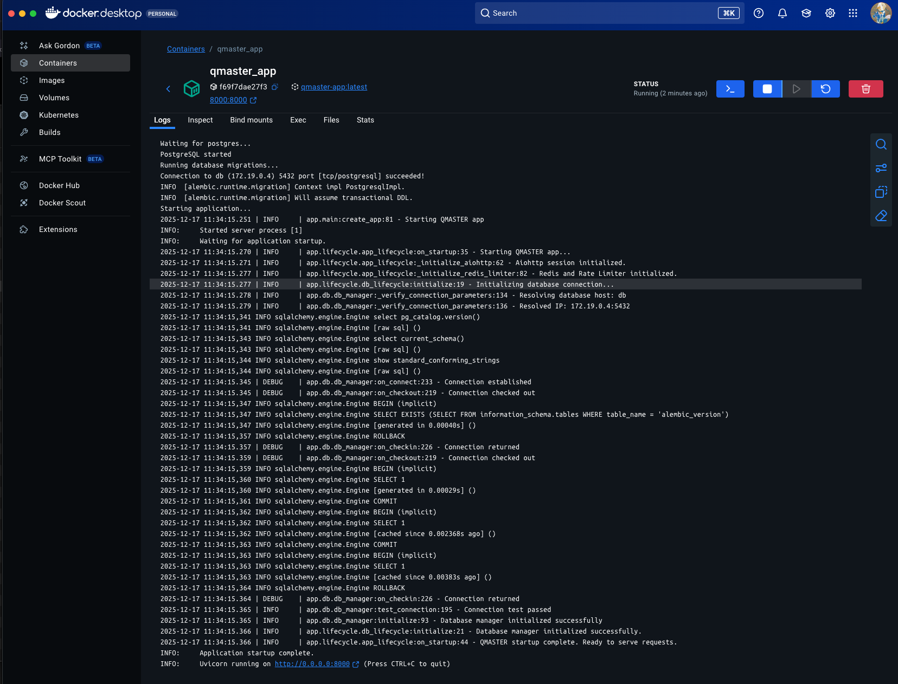
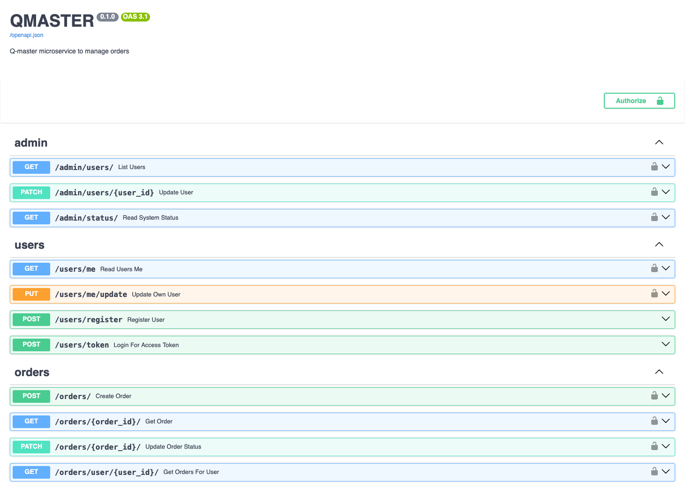
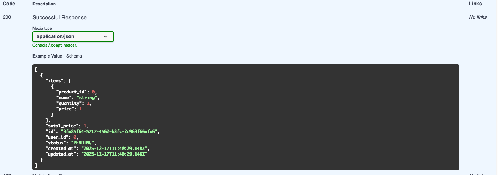
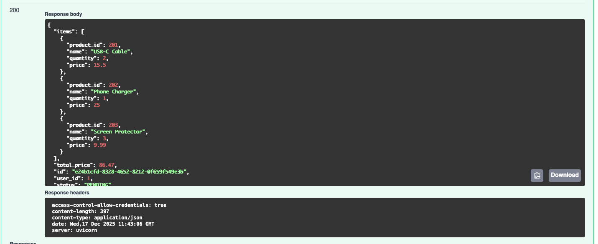
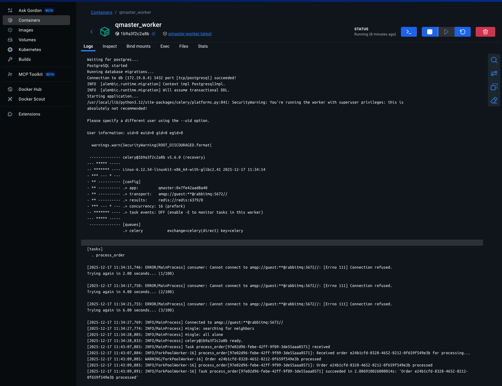

# QMASTER - FastAPI Order Management Service


[](https://www.docker.com/)


> **Cервис управления заказами (Q-master)**
>
> В рамках выполнения технического задания разработан высокопроизводительный асинхронный сервис управления заказами на **FastAPI**, полностью удовлетворяющий указанным функциональным и нефункциональным требованиям. Сервис поддерживает:
>
> - **JWT-аутентификацию и роли пользователей** (`user`, `staff`, `admin`) с защитой CORS и rate limiting.
> - **API эндпоинты для пользователей и администраторов**, включая регистрацию, получение токена, работу с заказами (`/orders/`) с проверкой прав доступа (владелец/админ).
> - **Базу данных PostgreSQL** с таблицей `orders` (UUID, user_id, items JSON, total_price, status enum, timestamps), полностью асинхронный доступ через SQLAlchemy + Alembic.
> - **Очереди сообщений через RabbitMQ** для публикации события `new_order` и интеграцию с **Celery** для фоновой обработки заказов (имитация обработки с `time.sleep(2)` и логированием).
> - **Кеширование заказов через Redis** с TTL = 5 минут, автоматическое обновление кеша при изменении заказа.
> - **Чистую архитектуру**: слой репозиториев (`repository.py`) для работы с БД, слой сервиса (`service.py`) для бизнес-логики и слой роутеров для API.
> - Полная **Docker Compose инфраструктура**: сервис, PostgreSQL, Redis, RabbitMQ и Celery воркеры.
>
> Данный релиз полностью соответствует требованиям ТЗ: функциональные API, безопасность, асинхронность, кеширование, фоновая обработка задач и контейнеризация.

---

## Overview

## 1. API Endpoints

✅ **All required endpoints exist and are functional:**

| ТЗ Endpoint                    | Status                                                                 |
|--------------------------------|------------------------------------------------------------------------|
| `/register/` (POST)            | Implemented in `user/router.py`                                        |
| `/token/` (POST)               | Implemented in `user/router.py`                                        |
| `/orders/` (POST)              | Implemented in `orders/router.py`, requires authentication             |
| `/orders/{order_id}/` (GET)    | Implemented, fetches from Redis cache first, falls back to DB         |
| `/orders/{order_id}/` (PATCH)  | Implemented, status update                                             |
| `/orders/user/{user_id}/` (GET)| Implemented, includes authorization (admin/owner)                      |

## 2. Database (PostgreSQL)

✅ **Fully compliant:**

**Table `orders`:**
- `id`: UUID, primary key
- `user_id`: int, FK to users
- `items`: JSON
- `total_price`: float
- `status`: enum (PENDING, PAID, SHIPPED, CANCELED)
- `created_at`, `updated_at`: timestamps

- Access is fully asynchronous via SQLAlchemy ORM.
- Repository layer allows future extensions (`repository.py`).

## 3. Message Queues (RabbitMQ)

✅ **Fully implemented:**
- On order creation: `process_order` Celery task is triggered.
- Task is queued in RabbitMQ (broker).
- Task simulates background processing (`time.sleep(2)` + logging).

## 4. Redis (Caching)

✅ **Fully implemented:**
- Orders are cached with TTL = 5 minutes.
- Cache invalidation happens on status update.
- First lookup always tries Redis, falls back to DB if miss.

## 5. Celery (Background Processing)

✅ **Fully implemented:**
- Background task is triggered on order creation.
- Logs the processed order.
- Fully asynchronous and decoupled from main FastAPI request.

## 6. Security

✅ **Fully implemented:**
- JWT authentication (OAuth2 Password Flow)
- Role-based access scopes (user, staff, admin)
- CORS middleware is configured (`main.py` + settings)
- SQL injection safe: ORM queries only
- Rate limiting: FastAPI Limiter + Redis

## 7. Non-functional Requirements

✅ **Fully implemented:**
- **FastAPI + Pydantic**: All models and validation are used.
- **SQLAlchemy + Alembic**: DB access + migrations supported.
- **Async RabbitMQ + Celery**: Task queue + background jobs.
- **Docker Compose**: Full infrastructure (app, DB, Redis, RabbitMQ, Celery).
- **Code structure**: Clear layered architecture (router → service → repository).

---

## Features

### 🚀 Modern Architecture
- **Asynchronous & High-Performance**: Built with **FastAPI** and **SQLAlchemy 2.0**.
- **Clean Layered Design**: Organized into router, service, and repository layers.
- **Dependency Injection**: Uses FastAPI’s DI for maintainable and testable code.
- **Production-Ready Logging**: Structured and configurable logging with **Loguru**.

### 🔒 Security & Authentication
- **Secure Authentication**: Robust **JWT** token-based flow.
- **Role-Based Authorization**: Flexible scopes (e.g., `user` vs. `admin`).
- **Password Hashing**: Safe password storage using **bcrypt**.

### 👤 User & Admin Management
- **User Registration**: Unique username and email validation.
- **User Authentication**: Login with username and password.
- **User Profile**: Retrieve and update personal data.
- **Admin Tools**: Admin-only endpoints for managing users.

### 🗄️ Database & Migrations
- **Async Database Access**: Fully asynchronous **SQLAlchemy ORM** with PostgreSQL.
- **Database Migrations**: Version-controlled schema with **Alembic**.
- **Database Metrics**: **Prometheus** metrics for connection pool & transactions.

### 🐳 Containerization & Deployment
- **Fully Containerized**: Production-ready **Docker Compose** setup (app + DB).
- **Robust Startup**: Entrypoint waits for DB and applies migrations automatically.

### 📖 Developer Experience
- **Interactive API Docs**: Auto-generated **Swagger UI** & **ReDoc**.

---

## Tech Stack

### 🐍 Core
- **Python 3.12**
- **FastAPI** — modern async web framework
- **Uvicorn** — lightning-fast ASGI server

### 🗄️ Database Layer
- **PostgreSQL** — robust relational database
- **SQLAlchemy (async)** — ORM with async support via `asyncpg`
- **Alembic** — database migrations
- **Prometheus Client** — DB connection pool & transaction metrics

### 🔒 Security & Auth
- **bcrypt** — password hashing
- **PyJWT / python-jose** — JWT authentication & authorization

### 🔁 Task Queue & Caching
- **Celery (>=5.6)** — asynchronous task queue for background processing
- **RabbitMQ** — message broker for Celery tasks
- **Redis** — caching layer for orders and rate limiting

### 📦 Tooling & Dev Experience
- **Pydantic** — data validation & parsing
- **Poetry** — dependency management
- **Ruff** — linter & formatter
- **Mypy** — static type checking
- **Pytest** — testing framework
- **Pre-commit** — Git hooks for code quality

### 🐳 Containerization
- **Docker & Docker Compose** — containerized, production-ready setup


---

## Installation & Setup

1. **Clone the repository:**

   ```bash
   gh repo clone valed-dm/qmaster
   cd qmaster
   ```

2. **Create the Environment File:**

 ```bash
   cp .env.example .env
```
   - DATABASE_URL (PostgreSQL connection string)
   - SECRET_KEY (JWT signing secret)
   - ALGORITHM (e.g., HS256)
   - ACCESS_TOKEN_EXPIRE_MINUTES (token expiry duration)
   - Other app-specific settings as needed


3. **Build and Run the Application:**


```bash
  docker-compose -f docker-compose.yml up -d
```

---

### API Endpoints Overview

- API Root (redirects to docs): http://localhost:8000  
- Interactive Docs (Swagger UI): http://localhost:8000/docs  
- Prometheus Metrics: http://localhost:8000/metrics  

| Endpoint | Method | Description | Authorization | Notes |
|---|---|---|---|---|
| **Authentication** | | | | |
| `/users/register` | POST | Register a new user account. | Public | Rate-limited |
| `/users/token` | POST | Obtain a JWT access token (login). | Public | Rate-limited |
| **User Profile (Self)** | | | | |
| `/users/me` | GET | Get the current authenticated user's profile. | Authenticated (`user`) | Rate-limited |
| `/users/me/update` | PUT | Update the current authenticated user's profile. | Authenticated (`user`) | Rate-limited |
| **Order Management** | | | | |
| `/orders/` | POST | Create a new order for the current user. | Authenticated (`user`) | Triggers **Celery** background task `process_order`; Rate-limited |
| `/orders/{order_id}/` | GET | Retrieve a specific order by its ID. | Authenticated (`user`, owner) | First tries **Redis cache** (TTL 5 min); Rate-limited |
| `/orders/{order_id}/` | PATCH | Update the status of an existing order. | Authenticated (`user`, owner, admin`) | Invalidates **Redis cache** after update; Rate-limited |
| `/orders/user/{user_id}/` | GET | Retrieve all orders for a specific user. | Authenticated (`user`, admin`) | Rate-limited |
| **Admin** | | | | |
| `/admin/users/` | GET | List all users in the system (paginated). | Admin only (`admin`) | Rate-limited |
| `/admin/users/{user_id}` | PATCH | Fully update any user's profile by their ID. | Admin only (`admin`) | Rate-limited |
| `/admin/status/` | GET | Get a system health or status report. | Admin only (`admin`) | Rate-limited |

---

### Orders Data Flow / Background Processing

### Orders Data Flow / Background Processing

```mermaid
flowchart LR
    A[Client Request] -->|POST /orders/| B[FastAPI Orders Router]
    B --> C[OrderService.create_order]
    C --> D[PostgreSQL: orders table]
    C --> E[Redis Cache: order_id]
    C --> F[Publish to RabbitMQ: new_order]
    F --> G[Celery Worker: process_order task]
    G -->|"process order (time.sleep(2))"| H[Order Processed Log]
    H --> D[Optional DB update]
    H --> E[Invalidate/Update Redis Cache]
    
    B -->|GET /orders/{order_id}/| E
    E -->|cache hit?| B
    E -->|cache miss| D --> B
```

---

## Security & Authentication

| Security Feature              | Implementation Details                          |
|-------------------------------|-----------------------------------------------|
| **Password Hashing**          | bcrypt algorithm for secure storage           |
| **Authentication Flow**       | OAuth2 password flow with JWT tokens          |
| **Token Features**            | Includes scopes for fine-grained permissions  |
| **Endpoint Protection**       | FastAPI Dependency Injection + SecurityScopes |
| **Admin Route Enforcement**   | Additional scope requirements for admin-only endpoints |

### Key Characteristics:
- 🔒 All passwords are irreversibly hashed before storage
- 🔑 JWT tokens contain user identity and permission scopes
- 🛡️ Automatic token validation on protected routes
- 👮 Admin routes require both valid token and admin privileges
- ⏱️ Tokens have configurable expiration for enhanced security

---

## Monitoring & Metrics

| Component               | Monitoring Solution      | Benefits                          |
|-------------------------|--------------------------|-----------------------------------|
| Database connections    | Prometheus metrics       | Tracks pool usage and efficiency  |
| Transaction durations   | Prometheus metrics       | Enables performance optimization  |


## License

This project is licensed under the **MIT License** - see the [LICENSE](LICENSE) file for full details.

[](https://opensource.org/licenses/MIT)


### SCREENSHOTS:

#### TEST COVERAGE:
[]()

[]()

[]()

[]()

[]()

[]()

[]()

[]()

[]()

[]()

[]()

[]()

[]()

[]()

[]()

[]()

[]()

[]()

[]()

[]()

[]()

[]()

[]()

[]()

[]()

[]()
